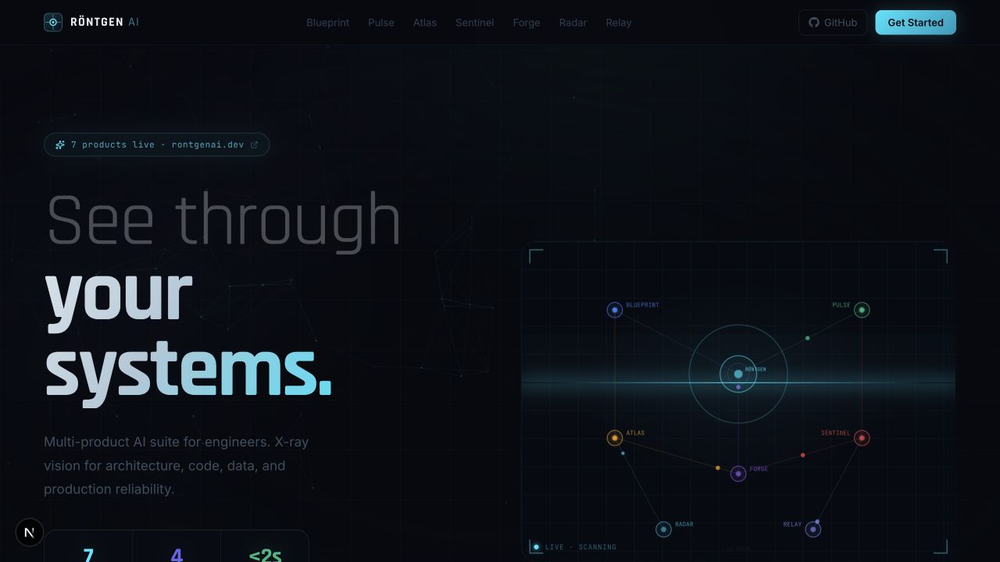
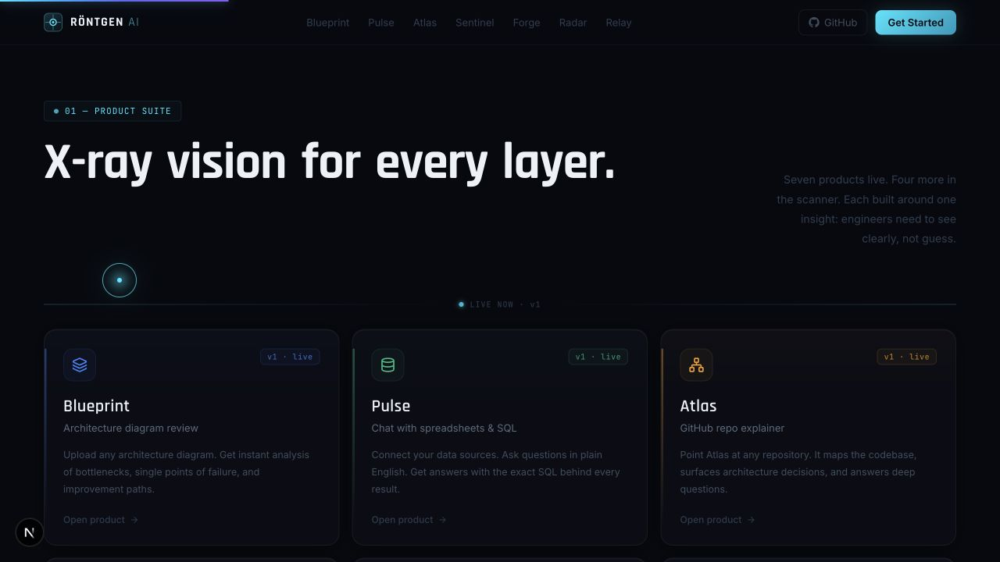
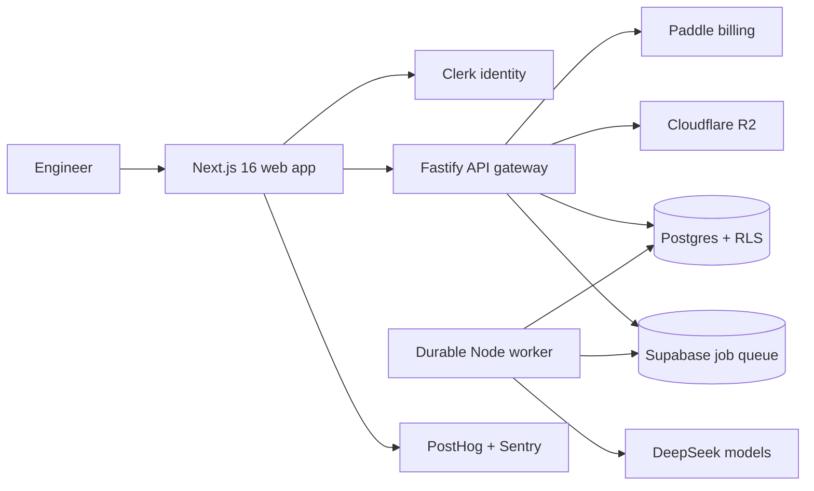

# Röntgen AI

> **See through your systems.** An AI engineering suite for understanding architecture, code, data, delivery pipelines, and production incidents.

<p align="center">
  <a href="https://rontgenai.dev">
    
  </a>
</p>

<p align="center">
  <a href="https://rontgenai.dev"><strong>Live product</strong></a>
  ·
  <a href="#architecture"><strong>Architecture</strong></a>
  ·
  <a href="#quick-start"><strong>Run locally</strong></a>
  ·
  <a href="./docs/PRODUCTION-HARDENING.md"><strong>Production model</strong></a>
</p>

<p align="center">
  
  
  
  
  
</p>

## Röntgen in 30 seconds

Engineering teams rarely lack data; they lack a fast way to turn architecture diagrams, repositories, pull requests, CI runs, and incident evidence into decisions.

Röntgen AI provides focused analysis tools over one shared platform:

- **Actionable output, not generic chat** — every product returns a structured review, diagnosis, plan, or prioritized set of fixes.
- **Durable AI work** — long-running analysis uses persisted jobs, leases, retries, idempotency, and a separate worker rather than holding an HTTP request open.
- **Production-minded boundaries** — authentication, metering, storage, billing, analytics, and model access sit behind explicit provider interfaces.

## Product tour

<p align="center">
  <a href="https://rontgenai.dev/#products">
    
  </a>
</p>

| Product | What it turns into an engineering decision |
|---|---|
| **Blueprint** | Architecture diagrams → bottlenecks, failure risks, and improvement paths |
| **Pulse** | Spreadsheets and SQL → answers with the query behind each result |
| **Atlas** | GitHub repositories → codebase maps, architecture context, and explainable answers |
| **Sentinel** | Pull requests → bug, security, and regression findings |
| **Forge** | Issues → implementation plans and reviewable pull requests |
| **Radar** | Logs, metrics, and traces → root-cause analysis and remediation steps |
| **Relay** | CI workflow evidence → critical paths, cache misses, flaky tests, and prioritized fixes |

Orbit, Aegis, Echo, and Arena remain planned products and are exposed through the waitlist rather than represented as shipped functionality.

## Architecture



The API gateway and worker intentionally share one TypeScript package. Product processors, validation schemas, and typed job payloads therefore evolve together instead of drifting across separate services.

### Request and job lifecycle

```text
authenticate → authorize → meter → validate input → persist job → acquire lease
      → run bounded AI analysis → validate result → persist output → report status
```

The worker model supports recovery after interruption, bounded retries, stale-lease reclamation, retention, and observable failure states. See [`docs/PRODUCTION-HARDENING.md`](./docs/PRODUCTION-HARDENING.md) for the operational details.

## What this repository demonstrates

| Concern | Implementation evidence |
|---|---|
| AI application design | Product-specific processors and validated model outputs instead of one general-purpose prompt |
| Asynchronous reliability | Durable jobs, worker leases, retry limits, recovery paths, and retention policies |
| Security boundaries | Clerk identity, server-side authorization, scoped uploads, rate limiting, and webhook verification |
| SaaS foundations | Usage metering, plan enforcement, waitlist persistence, Paddle checkout, and organization-aware usage |
| Operability | Health routes, Sentry integration, PostHog identity, structured monitoring, and deployment smoke tests |
| Quality | Unit-tested analysis paths plus web linting, type checks, builds, and Playwright release smoke coverage |

## Repository map

| Path | Responsibility | Runtime |
|---|---|---|
| [`web/`](./web) | Marketing site, authenticated product UI, query state, and provider adapters | Next.js, React, Tailwind, Clerk, TanStack Query |
| [`api-gateway/`](./api-gateway) | Authentication, metering, webhooks, product routes, and AI processors | Fastify, TypeScript, Node.js |
| [`api-gateway/src/worker.ts`](./api-gateway/src/worker.ts) | Durable analysis execution, retries, leases, and retention | Node.js, Supabase, DeepSeek |
| [`supabase/`](./supabase) | Shared schema, indexes, usage records, and job persistence | PostgreSQL, Row Level Security |
| [`docs/`](./docs) | Architecture decisions, phase notes, deployment, and production hardening | Markdown |

## Quick start

### Requirements

- Node.js 20 or newer
- npm
- Clerk credentials for authentication flows
- Supabase and DeepSeek credentials for persisted AI analysis

The public landing page and application shell can still be explored without every provider configured.

```bash
git clone https://github.com/captain-jack-sparrow909/rontgenai.git
cd rontgenai

cp web/.env.example web/.env.local
cp api-gateway/.env.example api-gateway/.env

npm --prefix web install
npm --prefix api-gateway install

npm run dev:web
```

In separate terminals, start the API and durable worker:

```bash
npm run dev:api
npm run dev:worker
```

The web application runs at [`http://localhost:3000`](http://localhost:3000). Local development uses inline execution by default; set `JOB_EXECUTION_MODE=worker` to exercise the production-style job lifecycle.

## Verification

```bash
npm run typecheck:api
npm run test:api
npm run lint:web
npm run build
```

The web workspace also contains a Playwright release smoke suite:

```bash
npm --prefix web run test:e2e
```

## Deployment

The production topology targets:

- **Vercel** for the Next.js web application
- **Render** for the Fastify API and background worker
- **Supabase** for Postgres-backed state and durable job leases
- **Cloudflare R2** for object storage

Deployment configuration lives in [`web/vercel.json`](./web/vercel.json), [`render.yaml`](./render.yaml), and the production environment examples. Follow [`docs/DEPLOYMENT.md`](./docs/DEPLOYMENT.md) for service settings, environment variables, DNS, migrations, and smoke tests.

## Platform boundaries

Callers depend on ports under [`web/src/platform/`](./web/src/platform):

| Port | Current provider |
|---|---|
| `LLMProvider` | DeepSeek |
| `ObjectStore` | Cloudflare R2 |
| `BillingProvider` | Paddle |
| `EmailProvider` | Spacemail |
| `CacheStore` | Upstash Redis |
| `AnalyticsProvider` | PostHog |

These boundaries keep product code independent from vendor-specific SDK details and make infrastructure changes deliberate.

## Documentation

- [`docs/DECISIONS.md`](./docs/DECISIONS.md) — product and technical decisions
- [`docs/PRODUCTION-HARDENING.md`](./docs/PRODUCTION-HARDENING.md) — job execution, resilience, security, and operations
- [`docs/DEPLOYMENT.md`](./docs/DEPLOYMENT.md) — deployment and smoke-test guide
- [`docs/ENGINEERING-INTELLIGENCE-EXPANSION.md`](./docs/ENGINEERING-INTELLIGENCE-EXPANSION.md) — product expansion design
- [`project-scope.md`](./project-scope.md) — original product brief

---

<p align="center">
  <strong>Röntgen AI</strong><br />
  See through your systems.
</p>
